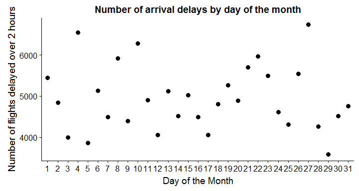
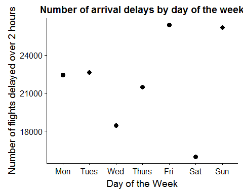
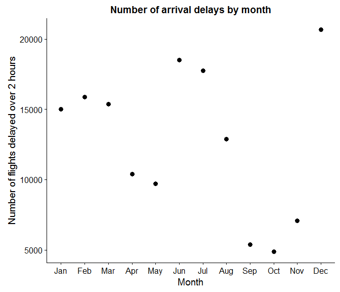
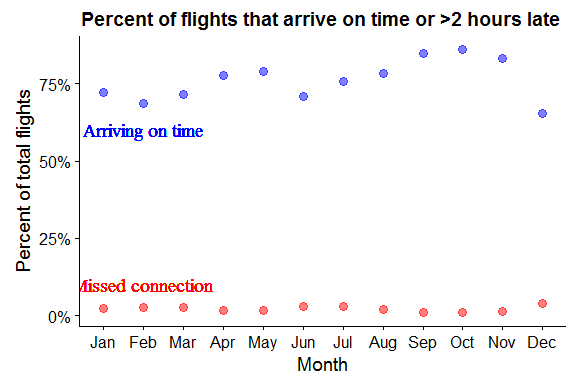
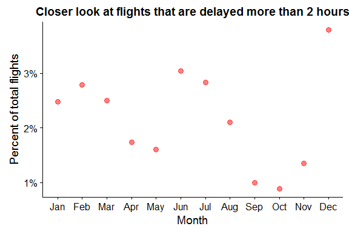

Bonnie
December 10, 2016

My first data science project!
------------------------------

My wonderful friend Dasha has provided our brand new data science club with a data set that she found (source: <http://stat-computing.org/dataexpo/2009/the-data.html>). We also provided the members with this nifty set of projects (<https://www.r-bloggers.com/descriptive-analytics-part-0-data-exploration/>) to work through to encourage us to learn R.
Our goal for our FIRST data science club meeting was to be able to use R/Rstudio to investigate a question and to create a deliverable in the form of a nice graph or a few. I chose to download the data set from 2008 just because it is the most recent data set there.

I hate transferring flights so I try to get one-way tickets as long as I can reasonably afford it. But those pesky times where I can't, as a risky flyer, I try to keep the transfer time between 1-2 hours. Thank god I haven't missed a flight yet (though there were very close calls), I want to know when I am more likely to miss my transfer flight. Simple question, no?

So first, I will limit the data set to when arrival delays are greater than 120 minutes. Then I will look at: 1) What are the factors that most influence longer arrival delays? 2) What time(s) of the year tend to have longer arrival delays?

### Step 1: load the data set and load some useful libraries. On my computer, this takes a very long time.

``` r
flights_orig <- read.csv("2008.csv.bz2")
flights <- flights_orig[which(flights_orig$ArrDelay > 120),]
airports <- read.csv("airports.csv")
```

### Next I wanted to be able to merge the location data from the airport data set to the flights data set based on either the origin of the flight or the destination of the flight using the merge function

``` r
# Merge with airport location info
airports_origin <- airports
airports_dest <- airports
colnames(airports_origin)[1] <- "Origin"
colnames(airports_dest)[1] <- "Dest"
origin_merge <- merge(airports_origin, flights, by = "Origin")
dest_merge <- merge(airports_dest, flights, by = "Dest")
```

I used linear regression to look at the influence of certain variables that were in the data set: I'm interested in the variables that I can use to predict how late I will be while I'm on the plane so I can fret about it during my flight, feel the regret about my choice and be annoyed about how my mother was right. Variables to use: Month, day of month, day of week, departure time, CRS departure time, departure delay, origin longitude, origin latitude, destination longitude, destination latitude, distance, taxiout, weather delay, National Airtime System (NAS) delay, security delay

``` r
# Here we go: generating linear models for each individual parameter
lm_month <- lm(ArrDelay ~ Month, data=flights)
lm_DoM <- lm(ArrDelay ~ DayofMonth, data=flights)
lm_DoW <- lm(ArrDelay ~ DayOfWeek, data=flights)
lm_deptime <- lm(ArrDelay ~ DepTime, data=flights)
lm_depdelay <- lm(ArrDelay ~ DepDelay, data=flights) #largest R^2 = 0.8379
lm_origin_lat <- lm (ArrDelay ~ lat, data = origin_merge)
lm_origin_long <- lm (ArrDelay ~ long, data = origin_merge)
lm_dest_lat <- lm (ArrDelay ~ lat, data = dest_merge)
lm_dest_long <- lm (ArrDelay ~ long, data = dest_merge)
lm_distance <- lm( ArrDelay ~ Distance, data = flights)
lm_taxiout <- lm(ArrDelay ~ TaxiOut, data = flights)
lm_weather <- lm(ArrDelay ~ WeatherDelay, data = flights)
lm_NAS <- lm(ArrDelay ~ NASDelay, data = flights)
lm_security <- lm(ArrDelay ~ SecurityDelay, data = flights)
```

To save space, I haven't printed out the summary statements of each linear model. If you are interested, please feel free to check it out by running this code! Looking at the R-squared values, which essentially describes the the amount of variance explained by the tested variable, looks like departure delay has the biggest effect on arrival delay. That makes the most sense to everyone- leave late, arrive late.

### What if I include more parameters in my model (without overfitting)?

``` r
lm_depdelay_1 <- lm(ArrDelay ~ DepDelay + WeatherDelay, data = flights) # R-squared = 0.8865
lm_depdelay_2 <- lm(ArrDelay ~ DepDelay + NASDelay, data = flights) #best R-squared value 0.9161
lm_depdelay_3 <- lm(ArrDelay ~ DepDelay + Distance, data = flights) #0.8853

AIC(lm_depdelay_1)
```

    ## [1] 1520790

``` r
AIC(lm_depdelay_2)
```

    ## [1] 1484729

``` r
AIC(lm_depdelay_3)
```

    ## [1] 1522600

Based on the R-squared, the second model better explains the variance and models \#1 and \#3 do equally well. AIC results are in accordance with the R-squared results. Looks like the best way to predict how delayed the plane will be is departure delay, and if I am hoping to get a better estimate, I better take a look at the cause of the departure delay as well! If it's due to security, then I can feel a little bit more at ease. If it 's weather, I can feel a slight anxiety. If it's because of the NAS, then I will just have to meditate so hard.

### So when would be the best time of week/month/year to play this dangerous game?

``` r
flights$DayofMonth <- factor(flights$DayofMonth, levels = c(1:31))
flights$DayOfWeek <- factor(flights$DayOfWeek, levels = c(1:7))
flights$Month <- factor(flights$Month, levels = c(1:12))

by_day <- group_by(flights, DayofMonth)
by_weekday <- group_by(flights, DayOfWeek)
by_month <- group_by(flights, Month)

day_summarise <-  summarise(by_day, count=n(), arr_mean=mean(ArrDelay, na.rm = TRUE), arr_sd = sd(ArrDelay, na.rm = TRUE), arr_sem = sd(ArrDelay, na.rm = TRUE)/sqrt(count))
weekday_summarise <-  summarise(by_weekday, count=n(), arr_mean=mean(ArrDelay, na.rm = TRUE), arr_sd = sd(ArrDelay, na.rm = TRUE), arr_sem = sd(ArrDelay, na.rm = TRUE)/sqrt(count))
month_summarise <-  summarise(by_month, count=n(), arr_mean=mean(ArrDelay, na.rm = TRUE), arr_sd = sd(ArrDelay, na.rm = TRUE), arr_sem = sd(ArrDelay, na.rm = TRUE)/sqrt(count))

day_summarise_plot <- ggplot(day_summarise, aes(x = DayofMonth, y = count)) + geom_point(size = 3) + labs(x = "Day of the Month", y = "Number of flights delayed over 2 hours", title = "Number of arrival delays by day of the month")
day_summarise_plot
```



``` r
week_summarise_plot <-ggplot(weekday_summarise, aes(x = DayOfWeek, y = count)) + geom_point(size = 3) + labs(x = "Day of the Week", y = "Number of flights delayed over 2 hours", title = "Number of arrival delays by day of the week") + scale_x_discrete(labels = c("1"="Mon", "2"="Tues", "3"="Wed", "4"="Thurs", "5"="Fri", "6"="Sat", "7"="Sun"))
week_summarise_plot
```



``` r
fig.width = 6
month_summarise_plot <-ggplot(month_summarise, aes(x = Month, y = count)) + geom_point(size = 3) + labs(x = "Month", y = "Number of flights delayed over 2 hours", title = "Number of arrival delays by month") + scale_x_discrete(labels= c("1"="Jan", "2"="Feb", "3"= "Mar", "4"= "Apr", "5"= "May", "6"= "Jun", "7"= "Jul", "8"= "Aug", "9"= "Sep", "10"= "Oct", "11"= "Nov", "12"= "Dec"))
month_summarise_plot
```



So what I've learned is to at least try to avoid taking the risk on Friday and Sunday flights where you are more likely to experience longer delays. Also be more cautious around summer and winter months- essentially holiday times when more people are traveling. Take it easy around the spring and fall- my favorite times to travel.

But this is number of delayed flights. This doesn't take into account the total number of flights. Maybe there is an increase in the total number of delayed flights because there are more flights in general during those times of year, so in actuality, the proportion of delayed flights is the same?

So blue = percent of flights on time (arrived with a less than 15 minute delay). To me, this is enough time to find the other terminal and make the other connecting flight) red = percent of flights with arrival delay more than 2 hours. Most likely would've missed that flight



Looks like in the spring and fall, I will have a higher chance of arriving on time and making my connecting flight comfortably. Taking a closer look at the flights that are delayed more than 2 hours, yes Summer and December holidays increase the percent of delayed flights, but the difference is of about 2%. Maybe this isn't actually significant. So to me, seems like the chances of missing my connection is very low but chances of my plane arriving on time can differ by 20%!

I'm young. I'll take the risk. I've got the rest of my life to learn and become my practical mother.
